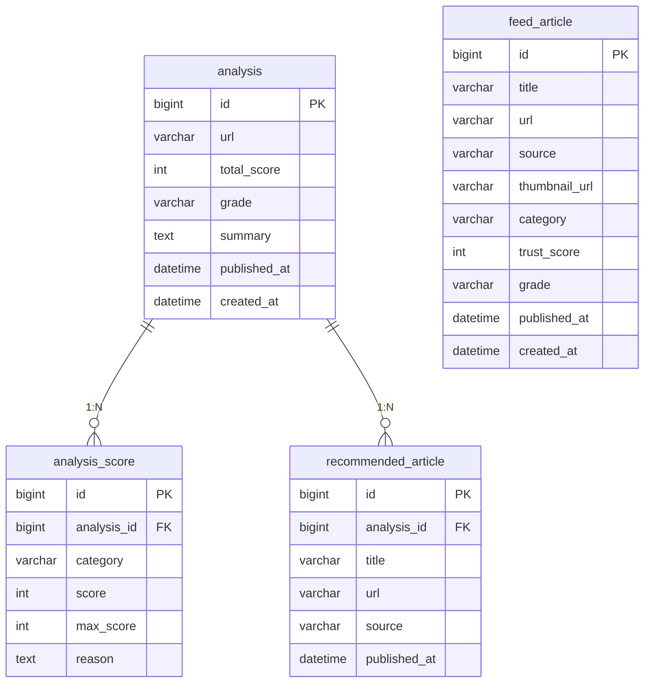

# VeriWeb — 웹 신뢰도 분석 플랫폼

> **Verify + Web** | 웹 페이지의 출처, 근거, 정보 일관성, 조작 패턴 등을 분석해 신뢰도를 점수로 평가하는 플랫폼

| 항목 | 내용 |
|---|---|
| 개발 기간 | 2026.03 ~ 2026.06 |
| 타겟 사용자 | 인터넷에서 정보를 탐색하는 일반 사용자, 허위 정보 피해 경험자 |
| 기술 스택 | React / Spring Boot / MySQL |

---

## 목차

1. [기획 배경](#1-기획-배경)
2. [핵심 기능](#2-핵심-기능)
3. [신뢰도 점수 기준](#3-신뢰도-점수-기준)
4. [기술 스택](#4-기술-스택)
5. [화면 구성](#5-화면-구성)
6. [ERD](#6-erd)
7. [API 명세](#7-api-명세)
8. [요구사항 명세](#8-요구사항-명세)

---

## 1. 기획 배경

### 문제 상황
인터넷에는 뉴스, 블로그, 커뮤니티 글 등 다양한 정보가 존재하지만, 출처가 불분명하거나 허위·과장된 정보가 함께 퍼지는 경우가 많다.

### 실제 사례
- **캄차카 폭설 AI 조작 영상 사건 (2026.01)** — AI로 만든 아파트 10층 높이 폭설 영상이 SNS를 통해 급속히 확산, KBS·중앙일보·조선일보 등 주요 언론이 AI 조작 영상을 사실인 것처럼 보도
- **AI 펜타곤 폭파 가짜 사진 사건 (2023)** — AI로 생성된 미 국방부 폭발 사진이 SNS에 퍼지며 주가 일시 폭락
- **건강 정보 오남용** — 블로그·커뮤니티에 퍼진 잘못된 의학 정보를 믿고 잘못된 행동을 하는 사례 빈번

### 해결 방향
사용자가 URL을 입력하면 출처, 근거, 일관성, 조작 패턴 등을 자동 분석하여 신뢰도 점수를 제공하고, 신뢰할 수 있는 공식 기사를 함께 제공하는 플랫폼 구축

---

## 2. 핵심 기능

| # | 기능 | 설명 |
|---|---|---|
| 1 | URL 기반 신뢰도 분석 | URL 입력 시 출처·근거·일관성·조작 패턴을 분석하여 0~100점의 신뢰도 점수 제공 |
| 2 | 정보 출처 및 근거 분석 | 작성자 명시 여부, 외부 출처 링크, 논문/공식 자료 인용 수 등 분석 |
| 3 | 유사 정보 비교 및 일관성 확인 | 타 신뢰 매체와 내용 교차 검증, 일관성 일치율 측정 |
| 4 | 공식 기사 추천 | 분석 결과 하단에 동일 주제의 공식 언론사 기사 추천 (분석한 도메인 제외) |
| 5 | 신뢰도 피드 | 일정 점수 이상의 공식 기사를 자동 수집하여 카드형 피드로 모아보기 (카테고리별 필터) |
| 6 | AI 이미지 & AI 영상 판별 | LLM 기술을 사용한 AI 생성물 판별 |

---

## 3. 신뢰도 점수 기준

### 등급 기준

| 등급 | 점수 |
|---|---|
| 🟢 신뢰 (SAFE) | 80점 이상 |
| 🟡 주의 (CAUTION) | 50 ~ 79점 |
| 🔴 위험 (DANGER) | 49점 이하 |

### 기본 7개 항목 (현재 구현)

글의 카테고리를 자동 분류한 뒤 카테고리에 맞는 배점 기준을 적용한다. 미정의 카테고리는 Claude API가 즉석으로 기준 생성.

| 항목 | 가중치 | 설명 |
|---|---|---|
| DOMAIN (도메인 신뢰도) | 15% | .gov/.edu/주요 언론사 여부, HTTPS 여부 |
| AUTHOR (작성자/출처 명확성) | 10% | 작성자 이름, 소속, 연락처 명시 여부 |
| REFERENCE (근거/인용 충실도) | 15% | 외부 출처 링크 수, 논문/공식 자료 인용 수 |
| CONSISTENCY (정보 일관성) | 20% | 타 신뢰 매체와 내용 교차 검증 일치율 |
| MANIPULATION (조작/품질 이상 징후) | 15% | 어그로성 제목, 감정적 언어 과다, 광고성 패턴 탐지 |
| ACADEMIC (학술 저널 인용) | 15% | PubMed, Google Scholar, DBpia 등 등재 논문 인용 여부 |
| GOV (정부/공공기관 자료 인용) | 10% | 정부기관(.go.kr/.gov), 국제기구(WHO, UN) 공식 자료 출처 명시 |

**점수 계산:** `총점 = Σ(항목 점수(0~100) × 가중치%) / 100`

### 카테고리별 세분화 배점 (v3)

| 카테고리 | 주요 특징 |
|---|---|
| 1. 뉴스/언론 | 도메인(25) + 작성자(20) + 정보일관성(25) + 조작징후(20) + 근거(10) |
| 2. 개발/기술 블로그 | 작성자신뢰도(25) + 기술적정확성(25) + 근거(20) + 정보일관성(20) + 조작징후(10) |
| 3. 학술 논문/리포트 | 학술저널인용(30) + 작성자(25) + 근거(25) + 도메인(10) + 정보일관성(10) |
| 4. 정부/공공기관 | 도메인(35) + 작성자(25) + 정보일관성(25) + 조작징후(15) |
| 5. 커뮤니티/포럼 | 정보일관성(30) + 근거(25) + 작성자신뢰도(20) + 조작징후(25) |
| 6. SNS/개인 미디어 | 작성자신뢰도(30) + 조작징후(30) + 정보일관성(25) + 근거(15) |
| 7. 의료/건강 | 학술저널인용(30) + 공공기관인용(25) + 작성자(20) + 조작징후(15) + 도메인(10) |
| 8. 법률/법령 | 공공기관인용(35) + 작성자(25) + 정보일관성(25) + 조작징후(15) |
| 9. 금융/경제 | 작성자(25) + 도메인(20) + 정보일관성(20) + 근거(20) + 조작징후(15) |
| 10. 교육/학습 | 작성자(25) + 근거(25) + 정보일관성(25) + 도메인(15) + 조작징후(10) |
| 11. 위키/백과사전 | 근거(30) + 정보일관성(25) + 작성자(20) + 조작징후(15) + 도메인(10) |
| 12. 팩트체크 전문 | 도메인(30) + 근거(30) + 작성자(20) + 정보일관성(20) |
| 13. 통계/데이터 리포트 | 근거(30) + 작성자(25) + 도메인(20) + 정보일관성(15) + 조작징후(10) |
| 14. 뉴스레터 | 작성자신뢰도(30) + 근거(25) + 정보일관성(25) + 조작징후(20) |
| 15. 과학/환경 | 학술저널인용(30) + 작성자(25) + 정보일관성(25) + 조작징후(10) + 도메인(10) |
| 16. 부동산/세금 | 공공기관인용(30) + 작성자(25) + 정보일관성(25) + 조작징후(20) |
| 17. 스포츠/엔터테인먼트 | 정보일관성(30) + 조작징후(25) + 작성자(25) + 근거(20) |
| 18. 여행/지역 | 조작징후(30) + 작성자신뢰도(25) + 정보일관성(25) + 근거(20) |
| 19. 음식/레시피 | 작성자(25) + 근거(25) + 정보일관성(25) + 조작징후(25) |
| 20. 종교/철학 | 작성자(30) + 근거(25) + 정보일관성(25) + 조작징후(20) |
| 21. 기업 보도자료/IR | 도메인(25) + 작성자(25) + 근거(25) + 조작징후(25) |
| 22. 제품 리뷰/비교 | 근거(30) + 정보일관성(25) + 작성자(25) + 조작징후(20) |
| 23. 마케팅 콘텐츠 | 조작징후(35) + 근거(25) + 정보일관성(20) + 작성자(20) **※ 상한 70점** |
| 24. 청원/캠페인 | 근거(30) + 정보일관성(25) + 작성자(25) + 조작징후(20) |
| 25. 정치/선거 | 조작징후(30) + 근거(25) + 정보일관성(25) + 작성자(20) **※ 상한 75점** |

### 공식 기사 수집 보완 규칙

| 항목 | 내용 |
|---|---|
| 목표 수집량 | 15~20개 |
| 기한 제한 | 분석 요청 기사 작성일 기준 ±2년 이내 기사만 수집 |
| 관련 기사 부족 시 | 5개 미만 수집 시 신뢰도 전체 점수에서 10~20점 추가 감점 |
| 관련 기사 없을 시 | "검증된 정보가 없습니다" 표시 |

---

## 4. 기술 스택

| 영역 | 기술 | 선택 이유 |
|---|---|---|
| 프론트엔드 | React | 컴포넌트 기반 UI, 추후 크롬 확장 프로그램 확장 가능 |
| 백엔드 | Spring Boot | Java 기반 안정적 서버, RESTful API 구현에 적합 |
| 데이터베이스 | MySQL | 관계형 데이터 관리, 분석 결과 캐싱 (동일 URL 재분석 방지) |
| AI 분석 | Claude API | 콘텐츠 분석, 조작 패턴 탐지, 이미지·영상 AI 판별 |
| 뉴스 수집 | NewsAPI / 네이버 뉴스 검색 API | 공식 기사 추천 및 피드 수집 |
| 도메인 분석 | WHOIS API | 도메인 연령, 등록 정보 조회 |
| 인프라 | Docker + GitHub Actions | 컨테이너 배포 및 CI/CD |

---

## 5. 화면 구성

### 화면 1: 메인 화면
- VeriWeb 로고 + 서비스 한 줄 설명
- URL 입력창 + 분석 버튼
- 분석 진행 상태 표시 (로딩 바)
- 하단에 신뢰도 피드 탭 진입 버튼

### 화면 2: 분석 결과 화면
- 최종 신뢰도 점수 (크게 표시, 색상으로 등급 구분 — 🔴위험 / 🟡주의 / 🟢신뢰)
- 항목별 점수 breakdown (막대 or 레이더 차트)
- 근거 설명 텍스트 (왜 이 점수인지)
- 근거 링크 + 유사 정보 링크 목록
- 하단: 관련 공식 기사 추천 목록 (없을 경우 "검증된 정보가 없습니다" 표시)

### 화면 3: 신뢰도 피드 화면
- 일정 점수 이상의 공식 기사를 카드형 UI로 나열 (인스타그램 피드 형식)
- 카테고리별 필터 (전체 / 정치 / 경제 / IT / 건강)
- 각 카드: 썸네일 + 제목 + 출처 + 신뢰도 점수 표시

### 화면 4: AI 이미지/영상 판별
- 이미지·영상 파일을 넣을 칸
- 분석 결과

---

## 6. ERD



### 테이블 상세 정의

#### analysis (분석 결과)
| 컬럼명 | 타입 | NULL | 설명 |
|---|---|---|---|
| `id` | BIGINT | NOT NULL | PK, AUTO_INCREMENT |
| `url` | VARCHAR(2048) | NOT NULL | 분석 요청 URL |
| `total_score` | INT | NOT NULL | 최종 신뢰도 점수 (0~100) |
| `grade` | VARCHAR(10) | NOT NULL | 등급 (SAFE / CAUTION / DANGER) |
| `summary` | TEXT | NOT NULL | 점수 산출 근거 요약 |
| `published_at` | DATETIME | NULL | 분석 대상 기사 작성일 |
| `created_at` | DATETIME | NOT NULL | 분석 요청 시각 |

#### analysis_score (항목별 점수)
| 컬럼명 | 타입 | NULL | 설명 |
|---|---|---|---|
| `id` | BIGINT | NOT NULL | PK, AUTO_INCREMENT |
| `analysis_id` | BIGINT | NOT NULL | FK → analysis.id |
| `category` | VARCHAR(50) | NOT NULL | DOMAIN / AUTHOR / REFERENCE / CONSISTENCY / MANIPULATION / ACADEMIC / GOV |
| `score` | INT | NOT NULL | 항목 점수 |
| `max_score` | INT | NOT NULL | 항목 만점 |
| `reason` | TEXT | NOT NULL | 항목별 근거 설명 |

#### recommended_article (추천 기사)
| 컬럼명 | 타입 | NULL | 설명 |
|---|---|---|---|
| `id` | BIGINT | NOT NULL | PK, AUTO_INCREMENT |
| `analysis_id` | BIGINT | NOT NULL | FK → analysis.id |
| `title` | VARCHAR(512) | NOT NULL | 기사 제목 |
| `url` | VARCHAR(2048) | NOT NULL | 기사 URL |
| `source` | VARCHAR(255) | NOT NULL | 언론사명 |
| `published_at` | DATETIME | NOT NULL | 기사 작성일 |

유니크 제약: `(analysis_id, url)` — 동일 분석에 같은 기사 중복 추천 방지

#### feed_article (신뢰도 피드 기사)
| 컬럼명 | 타입 | NULL | 설명 |
|---|---|---|---|
| `id` | BIGINT | NOT NULL | PK, AUTO_INCREMENT |
| `title` | VARCHAR(512) | NOT NULL | 기사 제목 |
| `url` | VARCHAR(2048) | NOT NULL | 기사 URL (UNIQUE) |
| `source` | VARCHAR(255) | NOT NULL | 언론사명 |
| `thumbnail_url` | VARCHAR(2048) | NULL | 썸네일 이미지 URL |
| `category` | VARCHAR(50) | NOT NULL | POLITICS / ECONOMY / IT / HEALTH |
| `trust_score` | INT | NOT NULL | 신뢰도 점수 (0~100) |
| `grade` | VARCHAR(10) | NOT NULL | 등급 (SAFE / CAUTION / DANGER) |
| `published_at` | DATETIME | NOT NULL | 기사 작성일 |
| `created_at` | DATETIME | NOT NULL | 피드 등록 시각 |

### 추후 변경 예정 사항

| 변경 항목 | 현재 | 추후 |
|---|---|---|
| 사용자 식별 | 없음 (비로그인) | `user` 테이블 추가 후 `analysis.user_id` FK 연결 |
| 피드 북마크 | 없음 | `user_feed_bookmark` 테이블 추가 |
| 분석 캐시 | `analysis.url` 단순 중복 조회 | 별도 캐시 레이어 도입 고려 |

---

## 7. API 명세

> Base URL: `/api/v1`
> Content-Type: `application/json`

### 전체 엔드포인트

| 도메인 | 메서드 | 경로 | 설명 |
|---|---|---|---|
| 분석 | `POST` | `/api/v1/analyze` | URL 신뢰도 분석 요청 |
| 분석 | `GET` | `/api/v1/analyze/{analysisId}` | 분석 결과 단건 조회 |
| 피드 | `GET` | `/api/v1/feed` | 신뢰도 피드 기사 목록 조회 |
| 피드 | `GET` | `/api/v1/feed/{articleId}` | 피드 기사 단건 조회 |

### 공통 응답 포맷

```json
// 성공
{ "success": true, "data": {}, "message": null }

// 실패
{ "success": false, "data": null, "message": "에러 메시지", "code": "ERROR_CODE" }
```

---

### POST `/api/v1/analyze` — URL 신뢰도 분석 요청

**Request Body**

```json
{ "url": "https://example.com/article/12345" }
```

**Response `201`**

```json
{
  "success": true,
  "data": {
    "analysisId": 1,
    "url": "https://example.com/article/12345",
    "totalScore": 74,
    "grade": "CAUTION",
    "summary": "출처는 명확하나 교차 검증된 매체 수가 부족합니다.",
    "breakdown": [
      { "category": "DOMAIN",      "score": 13, "maxScore": 15, "reason": "HTTPS 적용, 도메인 연령 5년 이상, 주요 언론사 해당 없음" },
      { "category": "AUTHOR",      "score": 8,  "maxScore": 10, "reason": "작성자 이름 명시, 소속 불명확" },
      { "category": "REFERENCE",   "score": 11, "maxScore": 15, "reason": "외부 링크 3개 포함, 논문 인용 없음" },
      { "category": "CONSISTENCY", "score": 14, "maxScore": 20, "reason": "유사 기사 4건 교차 검증, 일치율 70%" },
      { "category": "MANIPULATION","score": 11, "maxScore": 15, "reason": "감정적 표현 일부 탐지, 광고성 패턴 없음" },
      { "category": "ACADEMIC",    "score": 10, "maxScore": 15, "reason": "Google Scholar 인용 논문 1건 확인" },
      { "category": "GOV",         "score": 7,  "maxScore": 10, "reason": "정부기관 공식 자료 출처 미명시" }
    ],
    "recommendedArticles": [
      {
        "title": "관련 공식 기사 제목",
        "url": "https://news.example.com/article/67890",
        "source": "연합뉴스",
        "publishedAt": "2026-02-15T09:00:00"
      }
    ],
    "createdAt": "2026-03-10T12:00:00"
  },
  "message": null
}
```

| 상태코드 | 에러 코드 | 설명 |
|---|---|---|
| `201` | — | 분석 성공 |
| `400` | `MISSING_URL` | URL 미입력 |
| `400` | `INVALID_URL` | 유효하지 않은 URL 형식 |
| `404` | `PAGE_NOT_FOUND` | 페이지 없음 |
| `422` | `CRAWL_FAILED` | 크롤링 불가 |
| `500` | `INTERNAL_SERVER_ERROR` | 서버 내부 오류 |

---

### GET `/api/v1/analyze/{analysisId}` — 분석 결과 단건 조회

POST `/api/v1/analyze` 의 `201` 응답 data 필드와 동일한 형식

| 상태코드 | 에러 코드 | 설명 |
|---|---|---|
| `200` | — | 조회 성공 |
| `404` | `ANALYSIS_NOT_FOUND` | 분석 결과 없음 |

---

### GET `/api/v1/feed` — 신뢰도 피드 기사 목록 조회

**Query Parameters**

| 파라미터 | 타입 | 필수 | 기본값 | 설명 |
|---|---|---|---|---|
| `category` | String | ❌ | 전체 | POLITICS / ECONOMY / IT / HEALTH |
| `page` | Int | ❌ | 0 | 페이지 번호 |
| `size` | Int | ❌ | 20 | 페이지 크기 |

**Response `200`**

```json
{
  "success": true,
  "data": {
    "articles": [
      {
        "id": 1,
        "title": "기사 제목",
        "url": "https://news.example.com/article/111",
        "source": "KBS",
        "thumbnailUrl": "https://news.example.com/thumbnail.jpg",
        "category": "IT",
        "trustScore": 88,
        "grade": "SAFE",
        "publishedAt": "2026-03-09T10:00:00"
      }
    ],
    "totalCount": 100,
    "page": 0,
    "size": 20,
    "hasNext": true
  },
  "message": null
}
```

| 상태코드 | 에러 코드 | 설명 |
|---|---|---|
| `200` | — | 조회 성공 |
| `400` | `INVALID_CATEGORY` | 유효하지 않은 카테고리 |

---

### GET `/api/v1/feed/{articleId}` — 피드 기사 단건 조회

| 상태코드 | 에러 코드 | 설명 |
|---|---|---|
| `200` | — | 조회 성공 |
| `404` | `ARTICLE_NOT_FOUND` | 기사 없음 |

### 공통 에러 코드

| 에러 코드 | HTTP 상태 | 설명 |
|---|---|---|
| `MISSING_URL` | 400 | URL 미입력 |
| `INVALID_URL` | 400 | 유효하지 않은 URL 형식 |
| `INVALID_CATEGORY` | 400 | 유효하지 않은 카테고리 |
| `PAGE_NOT_FOUND` | 404 | 분석 대상 페이지 없음 |
| `ANALYSIS_NOT_FOUND` | 404 | 분석 결과 없음 |
| `ARTICLE_NOT_FOUND` | 404 | 피드 기사 없음 |
| `CRAWL_FAILED` | 422 | 크롤링 불가 (robots.txt 차단 등) |
| `INTERNAL_SERVER_ERROR` | 500 | 서버 내부 오류 |

---

## 8. 요구사항 명세

### 기능 요구사항

#### FR-01. 메인 화면
- [x] VeriWeb 로고 화면 상단 중앙 표시
- [x] 서비스 한 줄 소개 문구 로고 하단 표시
- [x] URL 입력창 화면 중앙에 크게 표시
- [x] placeholder 텍스트 ("분석할 URL을 입력하세요")
- [x] "분석하기" 버튼 표시
- [x] 신뢰도 피드 탭으로 이동하는 버튼 표시
- [x] 페이지 진입 시 URL 입력창 자동 포커스
- [x] "분석하기" 버튼 클릭 또는 Enter 키 입력 시 분석 시작
- [x] URL 미입력 시 "URL을 입력해주세요" 오류 메시지
- [x] 유효하지 않은 URL 형식 입력 시 "올바른 URL 형식이 아닙니다" 오류 메시지
- [x] 분석 시작 시 로딩 바 또는 스피너 표시

#### FR-02. URL 유효성 검증
- [ ] http:// 또는 https:// 로 시작하는지 검증
- [ ] URL 형식이 올바르지 않을 경우 400 오류 반환
- [ ] 크롤링 불가능한 URL의 경우 "해당 페이지에 접근할 수 없습니다" 오류 반환
- [ ] 이미 분석된 URL의 경우 캐시된 결과 즉시 반환
- [ ] 존재하지 않는 페이지(404) URL 입력 시 "페이지를 찾을 수 없습니다" 오류 표시

#### FR-03. 신뢰도 분석
- [ ] 분석 요청 시 백엔드가 URL 페이지 콘텐츠 크롤링
- [ ] 도메인 신뢰도 분석 (.gov, .edu, 주요 언론사 여부, HTTPS)
- [ ] 작성자/출처 명확성 분석
- [ ] 근거/인용 충실도 분석
- [ ] 정보 일관성 분석 (교차 검증)
- [ ] 조작/품질 이상 징후 탐지
- [ ] 항목별 점수 합산하여 0~100점 최종 신뢰도 점수 계산
- [ ] 점수 산출 근거 항목별 텍스트 정리
- [ ] 분석 결과 DB 저장 (동일 URL 재요청 시 캐시 결과 반환)

#### FR-04. 분석 결과 화면
- [ ] 분석한 URL 상단 표시
- [ ] 최종 신뢰도 점수 크게 표시
- [ ] 점수에 따른 색상 등급 표시 (🔴 위험: 0~49 / 🟡 주의: 50~79 / 🟢 신뢰: 80~100)
- [ ] 항목별 점수 breakdown 시각화 (막대 또는 레이더 차트)
- [ ] 항목별 점수 옆 근거 설명 텍스트 표시
- [ ] 근거 링크 목록 표시
- [ ] 하단 공식 기사 추천 섹션 표시
- [ ] "다시 분석하기" 버튼 표시

#### FR-05. 공식 기사 추천
- [ ] 분석 결과 화면 하단에 "관련 공식 기사" 섹션 표시
- [ ] 각 추천 기사 카드에 제목, 출처(언론사명), 작성일 표시
- [ ] 관련 공식 기사가 없을 경우 "검증된 정보가 없습니다" 메시지 표시
- [ ] 분석 완료 후 NewsAPI / 네이버 뉴스 검색 API로 기사 수집
- [ ] 기사 작성일 기준 ±2년 이내 기사만 포함
- [ ] 분석한 URL과 동일한 도메인 기사 추천 목록에서 제외
- [ ] 15~20개를 목표로 수집
- [ ] 수집 기사 5개 미만 시 최종 점수에서 10~20점 추가 감점

#### FR-06. 신뢰도 피드
- [x] 피드 화면 상단 카테고리 필터 탭 (전체 / 정치 / 경제 / IT / 건강)
- [x] 기사 목록 카드형 UI (인스타그램 피드 형식)
- [x] 각 카드에 썸네일, 제목, 출처, 신뢰도 점수, 작성일 표시
- [x] 신뢰도 점수 색상 배지로 구분
- [x] 카테고리 탭 클릭 시 해당 카테고리 기사 필터링
- [x] 기사 카드 클릭 시 해당 기사 URL 새 탭으로 열기
- [ ] 백엔드 NewsAPI 주기적 기사 수집 (스케줄러 미구현)
- [ ] 수집 기사 신뢰도 점수 자동 산정
- [ ] 일정 점수 이상 기사만 피드 등록

### 비기능 요구사항

#### NFR-01. 성능
- [ ] URL 분석 요청 후 결과 반환까지 30초 이내 완료
- [ ] 동일 URL 재분석 요청은 캐시를 통해 3초 이내 반환
- [ ] 피드 기사 목록 2초 이내 로드
- [ ] 동시에 다수의 분석 요청 처리 가능

#### NFR-02. 안정성
- [ ] 크롤링 불가 URL에 대해 적절한 오류 메시지 반환
- [ ] 외부 API 장애 시 서비스 중단 없이 해당 기능만 비활성화
- [ ] 분석 중 오류 발생 시 사용자에게 명확한 오류 메시지 표시

#### NFR-03. 호환성
- [ ] PC 및 모바일 브라우저에서 정상 동작
- [ ] Chrome, Safari, Edge 등 주요 브라우저 지원

#### NFR-04. 보안
- [ ] 악성 URL 입력에 대한 방어 처리
- [ ] API 요청에 대한 기본적인 Rate Limiting 적용
